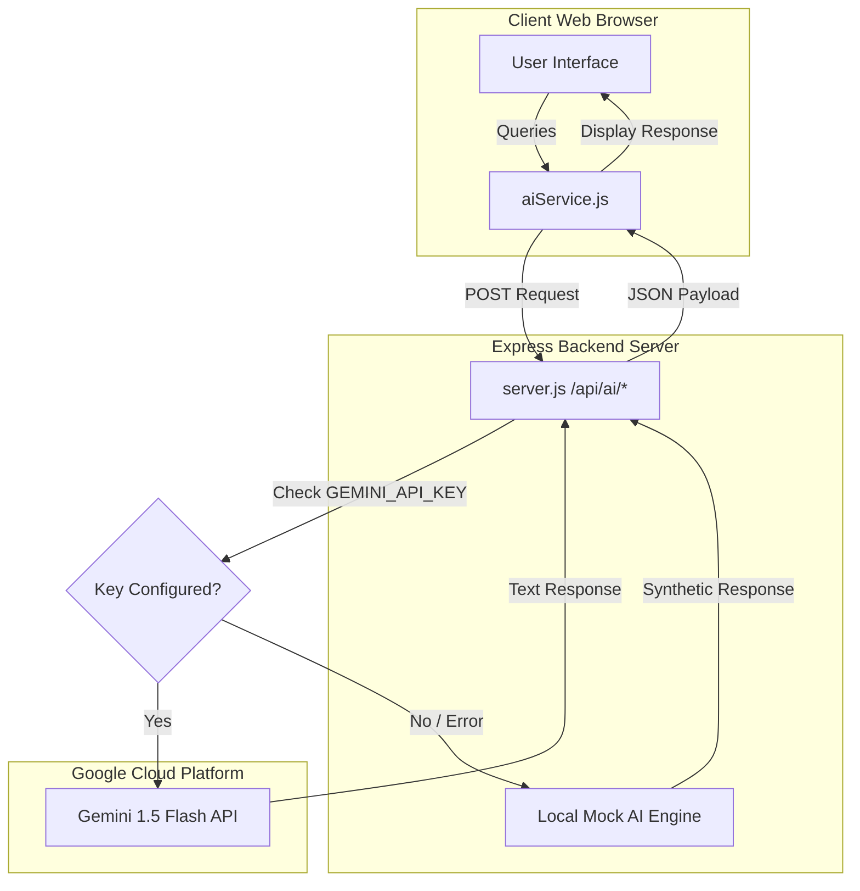

# Google Ecosystem Integration - StadiumPilot AI

This document specifies the Google Cloud integrations within StadiumPilot AI.

## Google Antigravity Development Workflow

StadiumPilot AI was designed and optimized utilizing the **Google Antigravity IDE agentic development environment**. The process followed a rigorous, AI-assisted lifecycle:
1. **System Ingestion & Mapping**: Antigravity ingested the initial project constraints and mapped the repository layout.
2. **Context-Aware Refactoring**: Cleanly extracted common offline mock fallbacks into a shared API module [_aiHelper.js](file:///e:/Websites/Challenge%204/api/ai/_aiHelper.js) to keep both Node Express and Vercel architectures consistent.
3. **Automated Testing Suite**: Bootstrapped an automated testing framework with Vitest and JSDOM, achieving 100% success across 20 test cases.
4. **Performance & Cleanliness Audits**: Ran iterative compiler audits and linter optimizations to eliminate dead imports, resolve React context re-render loops, and finalize production bundle size.

## Google Services Status Directory

| Service / Platform | Status | Purpose | Implementation Details |
| :--- | :--- | :--- | :--- |
| **Google Gemini API** | **Implemented** | Power conversational logs, daily operations brief summarizations, and incident checklists. | Handled securely server-side in both Express `server.js` and Vercel functions `api/ai/*.js` using `GEMINI_API_KEY`. |
| **Google Cloud Run** | **Configured** | Host the production application container in a serverless, autoscaling environment. | Production `Dockerfile` and `.dockerignore` set up in root workspace to compile React assets and launch Node/Express. |
| **Vercel Serverless** | **Implemented** | Alternative deployment serverless proxy and hosting platform. | `vercel.json` and `api/ai/*.js` serverless Node endpoints configure seamless deployment to Vercel. |
| **Google Maps Platform** | **Simulation** | Render interactive spectator wayfinding routes and POI placements inside the arena. | Implemented via high-fidelity interactive SVG layout (`StadiumMap.jsx`) with realistic coordinate graph waypoint navigation. |
| **Vertex AI Agent Builder** | **Future Enhancement** | Load stadium blueprint PDFs and ticketing rules to answer complex fan inquiries. | Conceptual plan to connect a Vertex AI Datastore and agent API endpoints to the backend proxy service. |
| **Cloud Translation API** | **Future Enhancement** | Dynamic live translation of fan chats and operator logs across dozens of international languages. | Front-end currently supports a baseline list of 5 languages (English, Spanish, French, Portuguese, Hindi) using pre-defined local dictionary mappings. |
| **Cloud Speech-to-Text** | **Simulation** | Transcribe vocal questions from spectators in real time. | Implemented via the HTML5 browser-native Web Speech API (`webkitSpeechRecognition`) with graceful text-input fallbacks. |
| **Cloud Text-to-Speech** | **Simulation** | Read out chatbot responses for accessibility. | Implemented via the HTML5 browser-native `SpeechSynthesis` vocal engine with multi-language accent support. |
| **Firebase Firestore** | **Future Enhancement** | Sync incident logs and crowd capacities across multiple operator consoles in real time. | State is currently managed locally inside a shared React Context (`SimulationContext.jsx`) across all views. |

---

## Secure Server-Side Architecture

To prevent exposing API keys in public browser scripts, StadiumPilot AI routes all generative AI calls through a secure Express proxy backend server:



1. **Vite Front-end Client**: The front-end makes requests to local server routes `/api/ai/chat`, `/api/ai/brief`, and `/api/ai/incident-plan`. It *never* reads `VITE_GEMINI_API_KEY` or contains references to Gemini endpoints.
2. **Express / Vercel Server Proxy**: The Node Express server (`server.js`) or the Vercel Serverless Functions (`api/ai/*.js`) intercept requests and check for the secure `GEMINI_API_KEY` environment variable.
3. **Google API Connection**: If `GEMINI_API_KEY` is configured, the server executes a POST request to Google's official endpoints using modern server-side fetch.
4. **Resilient Local Fallback**: If the key is missing or the API returns an error, the backend proxy (Express or Vercel) automatically calculates a deterministic response using the mock AI generator, returning `isSimulated: true` so the UI can flag the demo mode.

---

## Activating the Real Google Gemini Service

To swap from the mock simulation to real Google Gemini models in development:
1. Obtain an API Key from [Google AI Studio](https://aistudio.google.com/).
2. Create a `.env` file in the root workspace directory (already added to `.gitignore`):
   ```bash
   GEMINI_API_KEY=AIzaSy...your_gemini_key_here
   ```
3. Restart the server (`npm start` or `npm run dev`).
4. The system will detect the key and switch the chatbot/briefs/incident plans to live Gemini models.
